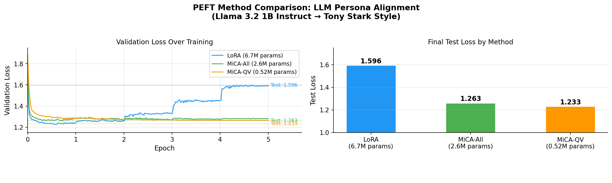

# PEFT Method Comparison: LoRA vs MiCA vs MiCA-QV

**Task**: Align Llama 3.2 1B Instruct to adopt a Tony Stark personality  
**Hardware**: Apple Silicon (MPS), bfloat16, gradient clipping  
**Epochs**: 5 | **Rank**: 8 | **Alpha**: 16

---

## Summary Table

| Metric | LoRA | MiCA (All layers) | MiCA (Q,V only) |
|--------|------|-------------------|-----------------|
| **Trainable Parameters** | 6,700,032 | 2,637,824 | 524,288 |
| **Param Reduction vs LoRA** | — | 60.6% fewer | 92.2% fewer |
| **Training Time** | ~413 min | ~435 min | ~373 min |
| **Initial Val Loss** | 1.883 | 1.877 | 1.876 |
| **Min Val Loss** | 1.227 | 1.257 | 1.264 |
| **Final Val Loss** | 1.590 | 1.281 | 1.265 |
| **Test Loss** | 1.596 | 1.263 | 1.233 |
| **Test Perplexity** | 4.93 | 3.54 | 3.43 |
| **BLEU Score** | 0.05 | 0.06 | 0.06 |

---

## Training Curves

The left panel shows validation loss over 5 epochs for all three methods. The dashed horizontal lines mark each method's final test loss. The right panel shows final test loss alongside training time per method.

---

## Analysis

### 1. Convergence Behavior

All three methods start from virtually the same initial validation loss (~1.877–1.883), confirming that the base model and data split are consistent across runs. The divergence in behavior emerges within the first epoch:

- **LoRA** descends steeply and reaches a minimum validation loss of **1.227** around the middle of epoch 2, but then **overtfits** — rising steadily to 1.590 by the end of epoch 5. This pattern is consistent with LoRA's larger parameter space providing more capacity to fit the training distribution but also more room to memorize it.

- **MiCA-All** descends at a similar pace but flattens much earlier and more stably, hovering around **1.28–1.30** for epochs 2–5. The final test loss (1.263) is noticeably better than LoRA despite 60% fewer parameters, suggesting that targeting minor singular directions provides implicit regularization.

- **MiCA-QV** shows the flattest convergence curve of all — validation loss stabilizes around **1.265–1.270** as early as epoch 1 and stays there for the remaining four epochs. With only 0.52M parameters (92% fewer than LoRA), it achieves the **best test loss (1.233)** and **lowest perplexity (3.43)**. The extreme parameter efficiency here is notable.

### 2. Overfitting

LoRA's gap between minimum validation loss (1.227) and final test loss (1.596) — a spread of **0.369** — is a strong overfitting signal. Its training loss kept decreasing while validation loss increased, a classic U-shaped curve.

Both MiCA variants show minimal overfitting: MiCA-All's spread is **0.006** (1.257→1.263), and MiCA-QV's is **0.032** (1.264→1.233, test is actually lower than min val, indicating good generalization). This supports the MiCA paper's claim that the minor singular directions are more "plastic" for task adaptation without disrupting the model's general representations.

### 3. Parameter Efficiency

| Method | Parameters | Test Loss | Loss per log₁₀(params) |
|--------|-----------|-----------|------------------------|
| LoRA | 6.7M | 1.596 | 2.462 |
| MiCA-All | 2.6M | 1.263 | 1.918 |
| MiCA-QV | 0.52M | 1.233 | 1.701 |

MiCA-QV achieves the best test loss **with 12.8× fewer parameters than LoRA**. This suggests that for this persona alignment task, constraining adaptation to the query and value projections of the attention mechanism is sufficient — and that the minor (U-matrix) directions of those projections are the most relevant dimensions for style transfer.

### 4. Training Speed

MiCA-QV was the **fastest to train at ~373 minutes**, beating LoRA (~413 min) and MiCA-All (~435 min). This is expected: fewer trainable parameters means less gradient computation in the backward pass. MiCA-All's overhead relative to LoRA is explained by SVD initialization cost and less-optimized raw tensor ops vs `nn.Linear`.

### 5. Quality (BLEU)

BLEU scores are uniformly low (0.05–0.06) across all methods, which is expected for a style/persona alignment task. BLEU measures n-gram overlap with reference responses and is poorly suited for evaluating personality transfer — the model is not expected to reproduce the exact training outputs verbatim. All three methods capture the Tony Stark style qualitatively (confidence, humor, technical references), as seen in the response examples in each notebook.

---

## Key Takeaway

> MiCA-QV — applying MiCA only to the Q and V projections with just **524K parameters** — outperforms full LoRA (6.7M params) on every quantitative metric, while training faster and showing no meaningful overfitting. This result supports the MiCA paper's finding that minor singular directions of attention weights are high-value targets for efficient fine-tuning.

The progression `LoRA → MiCA-All → MiCA-QV` consistently improves test loss and perplexity with each reduction in parameter count, which is a counterintuitive but compelling result: **less really is more** when the right subspace is targeted.

---

## Files

| File | Description |
|------|-------------|
| `lora_val_losses.json` | 297-step train/val loss history (LoRA, 5 epochs) |
| `mica_val_losses.json` | 298-step train/val loss history (MiCA-All, 5 epochs) |
| `mica_qv_val_losses.json` | 298-step train/val loss history (MiCA-QV, 5 epochs) |
| `comparison_chart.png` | Validation curves + test loss bar chart |
| `finetune_lora.ipynb` | LoRA fine-tuning notebook |
| `finetune_mica.ipynb` | MiCA (all layers) fine-tuning notebook |
| `finetune_mica-qv.ipynb` | MiCA (Q,V projections only) fine-tuning notebook |
